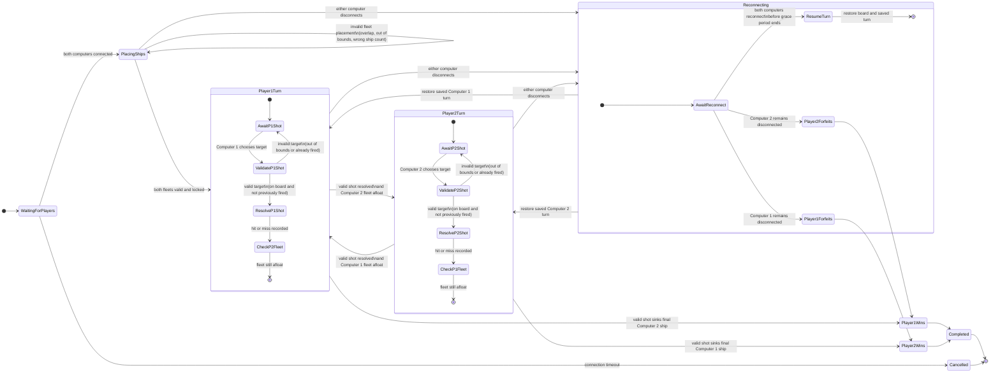

```mermaid
stateDiagram-v2
    direction LR

    [*] --> WaitingForPlayers
    WaitingForPlayers --> PlacingShips: both computers connected
    WaitingForPlayers --> Cancelled: connection timeout

    PlacingShips --> Player1Turn: both fleets valid and locked
    PlacingShips --> PlacingShips: invalid fleet placement\n(overlap, out of bounds, wrong ship count)
    PlacingShips --> Reconnecting: either computer disconnects

    state Player1Turn {
        [*] --> AwaitP1Shot
        AwaitP1Shot --> ValidateP1Shot: Computer 1 chooses target
        ValidateP1Shot --> ResolveP1Shot: valid target\n(on board and not previously fired)
        ValidateP1Shot --> AwaitP1Shot: invalid target\n(out of bounds or already fired)
        ResolveP1Shot --> CheckP2Fleet: hit or miss recorded
        CheckP2Fleet --> [*]: fleet still afloat
    }

    state Player2Turn {
        [*] --> AwaitP2Shot
        AwaitP2Shot --> ValidateP2Shot: Computer 2 chooses target
        ValidateP2Shot --> ResolveP2Shot: valid target\n(on board and not previously fired)
        ValidateP2Shot --> AwaitP2Shot: invalid target\n(out of bounds or already fired)
        ResolveP2Shot --> CheckP1Fleet: hit or miss recorded
        CheckP1Fleet --> [*]: fleet still afloat
    }

    Player1Turn --> Player2Turn: valid shot resolved\nand Computer 2 fleet afloat
    Player1Turn --> Player1Wins: valid shot sinks final Computer 2 ship
    Player2Turn --> Player1Turn: valid shot resolved\nand Computer 1 fleet afloat
    Player2Turn --> Player2Wins: valid shot sinks final Computer 1 ship

    Player1Turn --> Reconnecting: either computer disconnects
    Player2Turn --> Reconnecting: either computer disconnects

    state Reconnecting {
        [*] --> AwaitReconnect
        AwaitReconnect --> ResumeTurn: both computers reconnect\nbefore grace period ends
        AwaitReconnect --> Player1Forfeits: Computer 1 remains disconnected
        AwaitReconnect --> Player2Forfeits: Computer 2 remains disconnected
        ResumeTurn --> [*]: restore board and saved turn
    }

    Reconnecting --> Player1Turn: restore saved Computer 1 turn
    Reconnecting --> Player2Turn: restore saved Computer 2 turn

    Player1Forfeits --> Player2Wins
    Player2Forfeits --> Player1Wins
    Player1Wins --> Completed
    Player2Wins --> Completed
    Completed --> [*]
    Cancelled --> [*]
```
